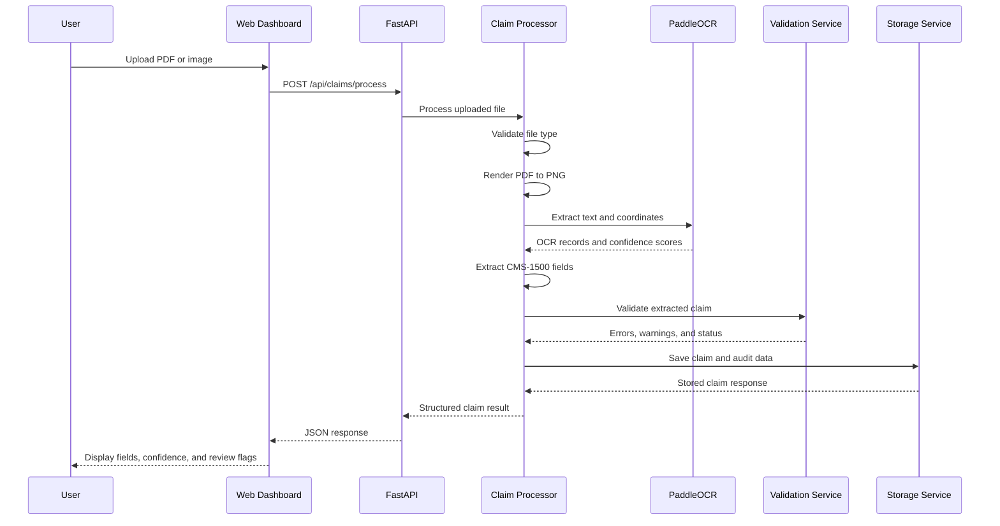
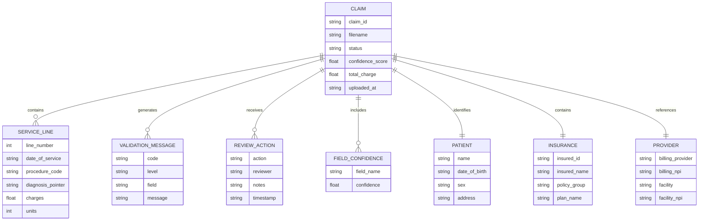

# ClaimBridge

### Healthcare Claim Document Intelligence and Human Review Platform

ClaimBridge is a template-aware document-intelligence prototype for processing synthetic CMS-1500 healthcare insurance claim forms.. 

It converts uploaded PDF or image claims into structured data using PDF rendering, PaddleOCR, calibrated spatial extraction, billing-consistency validation, confidence scoring, and human review workflows.

> This is an educational prototype for healthcare administrative intelligence. It does not diagnose patients, determine medical necessity, or make insurance-approval decisions.

---

## Problem

Healthcare billing and insurance operations depend heavily on manually reading claim forms.

Common challenges include:

- Manual claim-field entry
- Missing or incomplete information
- Invalid diagnosis and provider codes
- Charge-total inconsistencies
- Low-confidence OCR results
- Lack of correction history
- Difficulty exporting structured claim data

ClaimBridge demonstrates how document AI can support this workflow while keeping a human reviewer in control.

---

## Solution

```mermaid
flowchart LR
    A[PDF or Image Upload] --> B[PDF Rendering]
    B --> C[PaddleOCR]
    C --> D[Text and Bounding Boxes]
    D --> E[Calibrated Field Extraction]
    E --> F[Pydantic Claim Schema]
    F --> G[Billing Validation]
    G --> H[Confidence Scoring]
    H --> I[Human Review Dashboard]
    I --> J[Audit Trail and Export]
```



---

## Key Features

- PDF, PNG, and JPG claim upload
- PDF-to-PNG rendering using `pypdfium2`
- CPU-based PaddleOCR processing
- CMS-1500 field extraction
- Spatial extraction using calibrated form regions
- Diagnosis-code format checks
- NPI format checks
- Required-field validation
- Service-line validation
- Charge-total validation
- OCR confidence reporting
- Human correction workflow
- Manual-review audit trail
- Claim approval and rejection states
- SHA-256 file-hash deduplication
- Single-file and batch processing
- JSON export
- CSV summary export
- Demo mode with synthetic claims
- FastAPI REST API
- Browser-based dashboard

---

## Claim Processing Flow



---

## Technology Stack

### Backend

- Python 3.11
- FastAPI
- Pydantic
- PaddleOCR
- pypdfium2
- Pillow

### Frontend

- HTML
- CSS
- Vanilla JavaScript

### Storage

- JSON files
- Local filesystem
- In-memory claim index

### Evaluation

- Python verification scripts
- Field-level extraction evaluation
- API endpoint verification
- OCR and image-processing utilities

---

## Project Architecture

```text
ClaimBridge/
│
├── backend/
│   ├── main.py
│   ├── schemas/
│   │   └── claim_schema.py
│   └── services/
│       ├── claim_processor.py
│       ├── extraction_service.py
│       ├── ocr_service.py
│       ├── pdf_service.py
│       ├── storage_service.py
│       └── validation_service.py
│
├── frontend/
│   ├── index.html
│   ├── css/
│   │   └── style.css
│   └── js/
│       └── app.js
│
├── data/
│   ├── dataset/
│   ├── raw/
│   ├── processed/
│   └── uploads/
│
├── evaluate_extraction.py
├── evaluate_10_claims.py
├── test_api_endpoints.py
├── generate_claim.py
├── generate_dataset.py
├── run_ocr.py
├── validate_claim.py
├── verify_claim.py
└── README.md
```

---

## Claim Data Model



---

## Processing Pipeline

### 1. File Upload

The API accepts:

- PDF files
- PNG images
- JPG/JPEG images

### 2. PDF Rendering

PDF pages are rendered into PNG images using `pypdfium2`.

The current pipeline expects the CMS-1500 document to use the calibrated form layout and resolution.

### 3. OCR

PaddleOCR extracts:

- Recognized text
- OCR confidence scores
- Polygon coordinates
- Bounding boxes

Example:

```json
{
  "text": "INS7539906",
  "confidence": 0.98,
  "bbox": {
    "x1": 420,
    "y1": 210,
    "x2": 560,
    "y2": 235
  }
}
```

### 4. Field Extraction

The extraction service identifies:

- Patient name
- Patient date of birth
- Insured ID
- Insurance details
- Diagnosis codes
- Service lines
- Procedure codes
- Provider NPIs
- Charges
- Billing information
- Signature presence

### 5. Validation

The validation service checks:

- Required fields
- ICD-10 code format
- NPI length
- Diagnosis pointers
- Service-line completeness
- Total charge against service-line charges
- Low-confidence fields
- Signature presence

Possible claim statuses:

```text
auto_approved
needs_review
flagged
```

### 6. Human Review

Reviewers can:

- Inspect extracted fields
- Edit incorrect values
- Approve claims
- Reject or flag claims
- Add review notes
- Export structured claim data

Manual corrections store:

- Original value
- Corrected value
- Reviewer
- Timestamp

---

## Dataset

The current project uses synthetic CMS-1500 claim data.

Synthetic data is used because real healthcare claims contain protected health information and require strict privacy controls.

The repository includes:

- Synthetic claim PDFs
- Ground-truth JSON records
- Rendered claim images
- Evaluation scripts

The synthetic data should not be interpreted as representative of every real-world claim format or healthcare provider.

---

## Evaluation

The current repository includes an evaluation on 10 synthetic CMS-1500 claims.

```text
Correct fields: 528 / 530
Field-level exact-match accuracy: 99.62%
```

This result applies only to the evaluated synthetic claims and calibrated CMS-1500 template.

It should not be interpreted as general accuracy across real-world healthcare claims, handwritten documents, or unseen layouts.

Recommended future metrics include:

- OCR character error rate
- Field-level precision
- Field-level recall
- Field-level F1 score
- Exact-match accuracy
- Diagnosis-code accuracy
- Service-line accuracy
- Monetary-field error
- Validation-rule precision and recall
- Average processing latency

---

## API Endpoints

### Health Check

```http
GET /api/health
```

### Process a Claim

```http
POST /api/claims/process
```

Example:

```bash
curl -X POST \
  -F "file=@data/dataset/pdfs/claim_001.pdf" \
  http://127.0.0.1:8000/api/claims/process
```

### Process Multiple Claims

```http
POST /api/claims/process-batch
```

### List Claims

```http
GET /api/claims
```

Optional query parameters:

```text
status
search
```

Example:

```http
GET /api/claims?status=needs_review
```

### Get Claim Details

```http
GET /api/claims/{claim_id}
```

### Approve Claim

```http
POST /api/claims/{claim_id}/approve
```

### Submit Review or Corrections

```http
POST /api/claims/{claim_id}/review
```

Example:

```json
{
  "action": "review",
  "reviewer": "Human Auditor",
  "notes": "Verified patient information.",
  "corrections": {
    "patient.address.city": "Springfield"
  }
}
```

### Export Claim JSON

```http
GET /api/claims/{claim_id}/export
```

### Export All Claims as CSV

```http
GET /api/claims/export/csv
```

### Load Demo Dataset

```http
POST /api/demo/load
```

---

## Installation

### Clone the Repository

```bash
git clone https://github.com/thejuspk07/ClaimBridge.git
cd ClaimBridge
```

### Create a Virtual Environment

#### Windows

```bash
python -m venv .venv311
.venv311\Scripts\activate
```

#### Linux or macOS

```bash
python3 -m venv .venv311
source .venv311/bin/activate
```

### Install Dependencies

```bash
pip install fastapi uvicorn paddleocr paddlex pypdfium2 reportlab pillow
```

Depending on the operating system, PaddleOCR may require additional PaddlePaddle installation steps.

---

## Running the Application

Start the FastAPI server:

```bash
uvicorn backend.main:app --host 127.0.0.1 --port 8000
```

Open the dashboard:

```text
http://127.0.0.1:8000
```

Open the interactive API documentation:

```text
http://127.0.0.1:8000/docs
```

---

## Running Evaluation

```bash
python evaluate_extraction.py
```

```bash
python evaluate_10_claims.py
```

The evaluation report is saved under:

```text
data/processed/evaluation_report.json
```

---

## Running API Tests

Start the backend:

```bash
uvicorn backend.main:app --host 127.0.0.1 --port 8000
```

Run the verification suite:

```bash
python test_api_endpoints.py
```

The suite checks:

- Health endpoint
- Demo data loading
- Claim listing
- Claim details
- Claim approval
- Manual corrections
- JSON export
- CSV export
- Live PDF processing

---

## Example Output

```json
{
  "claim_id": "claim_001",
  "filename": "claim_001.pdf",
  "status": "needs_review",
  "confidence_score": 96.4,
  "patient": {
    "name": "Nair, David J",
    "dob": "04/12/1987"
  },
  "insurance": {
    "insured_id": "INS7539906"
  },
  "diagnosis_codes": [
    "M54.5"
  ],
  "total_charge": 1632.23,
  "validation": {
    "valid": true,
    "status": "needs_review",
    "error_count": 0,
    "warning_count": 1
  }
}
```

---

## Failure and Review Cases

ClaimBridge flags a claim for review when it detects:

- Missing required fields
- Invalid NPI format
- Invalid diagnosis-code format
- Missing service lines
- Charge-total mismatch
- Low OCR confidence
- Missing signature
- Diagnosis-pointer mismatch

The system supports human review instead of silently accepting uncertain extraction results.

---

## Limitations

The current version has several limitations:

- It is calibrated for a specific CMS-1500 layout.
- It is primarily evaluated on synthetic claims.
- Coordinate-based extraction may fail on unseen layouts.
- It does not support reliable handwriting recognition.
- It does not determine medical necessity.
- It does not verify insurance coverage.
- It does not detect fraud.
- It does not provide medical advice.
- Local storage is not suitable for production deployment.
- Authentication is not implemented.
- OCR processing is CPU-based.
- The current evaluation size is limited.

---

## Responsible AI Considerations

ClaimBridge is an administrative document-processing prototype.

It must not be used to:

- Diagnose patients
- Recommend treatment
- Automatically approve or deny insurance claims
- Determine medical necessity
- Replace trained billing or compliance staff
- Process real patient data without appropriate security controls

A real deployment would require:

- Properly governed or de-identified data
- Access control
- Encryption
- Secure object storage
- Audit logging
- Data-retention policies
- Human approval for consequential actions
- OCR and model monitoring
- Formal privacy and security review
- Domain-expert validation

---

## Future Improvements

### Data and Evaluation

- Add a larger held-out evaluation set.
- Test multiple CMS-1500 layouts.
- Add blur, rotation, noise, and low-resolution examples.
- Report precision, recall, and F1.
- Measure OCR character error rate.
- Add confidence calibration metrics.

### AI/ML

- Add document-quality classification.
- Add layout-aware extraction using LayoutLM or Donut.
- Add OCR error correction for medical codes.
- Add learned field-region detection.
- Compare rule-based extraction with a learned baseline.

### Backend

- Replace JSON storage with SQLite or PostgreSQL.
- Add background processing jobs.
- Add job-status endpoints.
- Add authentication and reviewer roles.
- Add upload limits and MIME validation.
- Add structured logging and monitoring.

### Frontend

- Add OCR bounding-box visualization.
- Highlight low-confidence fields on the document.
- Add pagination and advanced filtering.
- Add reviewer identity management.
- Add processing history and analytics.

### Deployment

- Add Docker support.
- Add GitHub Actions.
- Add production configuration management.
- Add secure object storage.
- Add observability and error tracking.

---

## Project Status

```text
Prototype / MVP
```

ClaimBridge demonstrates a complete template-aware healthcare claim-processing workflow with OCR, structured extraction, billing validation, human review, audit tracking, and export capabilities.

---

## Author

Built by **Thejus P. K.**

GitHub: [https://github.com/thejuspk07](https://github.com/thejuspk07)

---

## License

This project is released under the MIT License.
